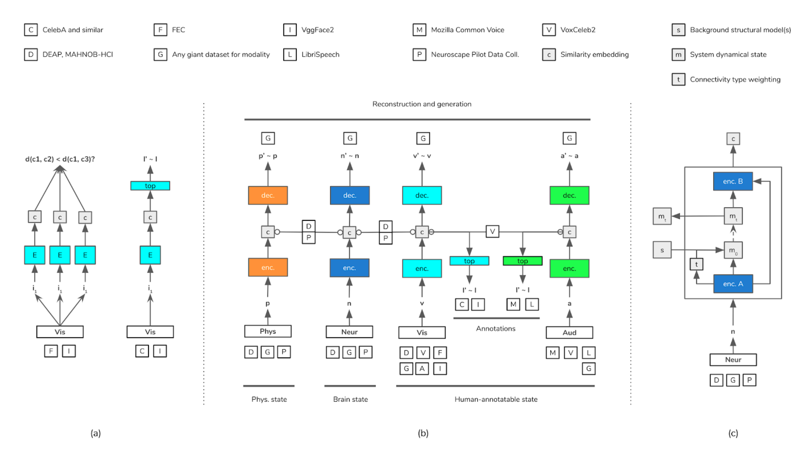
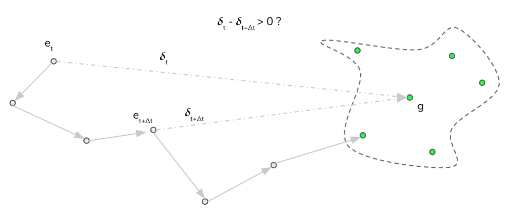

<a href="https://kubeflow.org" target="_blank"></img></a>

Towards clarifying our signals processing capabilities for various neural- and bio-sensing modalities (including for example de-noising, artifact removal, and feature identification); towards providing a mature foundation for transfer- and co-learning of predictors that provide value to the medical community; towards enabling biofeedback gaming that enhances users' self-awareness and self-regulatory skills regarding cognitive and emotional states (e.g. akin to making it easier to learn mindfulness meditation).

Find an intro to our machine learning methods at <a href="https://ai4hi.org/machine-learning" target="_blank">ai4hi.org/machine-learning</a> and a more technical summary of our current research plan [here](https://github.com/projectclarify/pcml/blob/master/docs/research-plan.md). A legacy version of a whitepaper originating the project can be found [here](https://github.com/projectclarify/experiments/raw/25e5a3e8f7854dc58f54db28cfda99181eb43b9e/public/assets/docs/project_clarify_whitepaper.pdf). Somewhat blue-sky interface design prototypes can be found at <a href="https://ai4hi.org/interface-design" target="_blank">ai4hi.org/interface-design</a>.

The following provides an overview of the computational infrastructure (on the Google Cloud) that enables us to make productive use of large-scale, high-content datasets including feeding Cloud TPUs at the necessary rate.

Various additional options are available for model deployment that offer lower-latency than the diagrammed option which is the simplest from a research prototyping perspective (enabling cross-platform support for all moderate-latency applications), see also [TFLite](https://www.tensorflow.org/lite), [tfjs](https://www.tensorflow.org/js), and [TFServing](https://www.kubeflow.org/docs/components/serving/tfserving_new/).

### Documentation outline (work in progress):

1. Audio/video correspondence learning
    1. [Extract raw .mp4's to GCS](docs/extract-videos.md)
2. Facial expression perceptual similarity
    1. [Preprocess and generate examples](docs/fec.md)

### Problem implementations

The tensor2tensor Problem object provides a way to encapsulate the steps and parameters involved in processing raw data into training examples (for a particular problem). These can be sub-classed or combined in the context of multi-problem training. More information is available [here](https://tensorflow.github.io/tensor2tensor/new_problem.html). The PCML codebase includes a growing number of Problem implementations in support of various sub-projects, enumerated here:

<table class="tg">
  <tr>
    <th class="tg-0lax">Dataset</th>
    <th class="tg-0lax">Visual</th>
    <th class="tg-0lax">Audio</th>
    <th class="tg-0lax">EEG</th>
    <th class="tg-0lax">Annotations</th>
    <th class="tg-0lax">Other modalities</th>
    <th class="tg-0lax">Status</th>
    <th class="tg-0lax">Code</th>
    <th class="tg-0lax">Source</th>
    <th class="tg-0lax">Citation</th>
  </tr>
  <tr>
    <td class="tg-0lax">AffectNet</td>
    <td class="tg-0lax">Image</td>
    <td class="tg-0lax">-</td>
    <td class="tg-0lax">-</td>
    <td class="tg-0lax">Emo. (rater)</td>
    <td class="tg-0lax">-</td>
    <td class="tg-0lax">Planned</td>
    <td class="tg-0lax"><a href="https://github.com/projectclarify/pcml/blob/master/pcml/datasets/affectnet.py" target="_blank">link</a></td>
    <td class="tg-0lax"><a href="http://mohammadmahoor.com/affectnet/" target="_blank">link</a></td>
    <td class="tg-0lax">7</td>
  </tr>
  <tr>
    <td class="tg-0lax">DEAP</td>
    <td class="tg-0lax">Video</td>
    <td class="tg-0lax">Audio</td>
    <td class="tg-0lax">32ch.</td>
    <td class="tg-0lax">Vid. rating</td>
    <td class="tg-0lax">Resp., temp., gsr</td>
    <td class="tg-0lax">Examples</td>
    <td class="tg-0lax"><a href="https://github.com/projectclarify/pcml/blob/master/pcml/datasets/deap.py" target="_blank">link</a></td>
    <td class="tg-0lax"><a href="https://www.eecs.qmul.ac.uk/mmv/datasets/deap/" target="_blank">link</a></td>
    <td class="tg-0lax">4</td>
  </tr>
  <tr>
    <td class="tg-0lax">FEC</td>
    <td class="tg-0lax">Image</td>
    <td class="tg-0lax">-</td>
    <td class="tg-0lax">-</td>
    <td class="tg-0lax">Percep. sim.</td>
    <td class="tg-0lax">-</td>
    <td class="tg-0lax">Examples</td>
    <td class="tg-0lax"><a href="https://github.com/projectclarify/pcml/blob/master/pcml/datasets/fec.py" target="_blank">link</a></td>
    <td class="tg-0lax"><a href="https://ai.google/tools/datasets/google-facial-expression/" target="_blank">link</a></td>
    <td class="tg-0lax">9</td>
  </tr>
  <tr>
    <td class="tg-0lax">MMIMP</td>
    <td class="tg-0lax">Video</td>
    <td class="tg-0lax">Audio</td>
    <td class="tg-0lax">Various</td>
    <td class="tg-0lax">Various</td>
    <td class="tg-0lax">Various</td>
    <td class="tg-0lax">Examples*</td>
    <td class="tg-0lax"><a href="https://github.com/projectclarify/pcml/blob/master/pcml/datasets/mmimp.py" target="_blank">link</a></td>
    <td class="tg-0lax">Various</td>
    <td class="tg-0lax">-</td>
  </tr>
  <tr>
    <td class="tg-0lax">VoxCeleb2</td>
    <td class="tg-0lax">Video</td>
    <td class="tg-0lax">Audio</td>
    <td class="tg-0lax">-</td>
    <td class="tg-0lax">N/A</td>
    <td class="tg-0lax">-</td>
    <td class="tg-0lax">Examples</td>
    <td class="tg-0lax"><a href="https://github.com/projectclarify/pcml/blob/master/pcml/datasets/vox_celeb_cbt.py" target="_blank">link</a></td>
    <td class="tg-0lax"><a href="http://www.robots.ox.ac.uk/~vgg/data/voxceleb/" target="_blank">link</a></td>
    <td class="tg-0lax">3</td>
  </tr>
  <tr>
    <td class="tg-0lax">DISFA</td>
    <td class="tg-0lax">Image</td>
    <td class="tg-0lax">-</td>
    <td class="tg-0lax">-</td>
    <td class="tg-0lax">FACS (rater)</td>
    <td class="tg-0lax">-</td>
    <td class="tg-0lax">Examples</td>
    <td class="tg-0lax"><a href="https://github.com/projectclarify/pcml/blob/master/pcml/datasets/disfa.py" target="_blank">link</a></td>
    <td class="tg-0lax"><a href="http://mohammadmahoor.com/disfa/" target="_blank">link</a></td>
    <td class="tg-0lax">6</td>
  </tr>
  <tr>
    <td class="tg-0lax">MAHNOB</td>
    <td class="tg-0lax">Video</td>
    <td class="tg-0lax">Audio</td>
    <td class="tg-0lax">32ch.</td>
    <td class="tg-0lax">Emo. (self)</td>
    <td class="tg-0lax">Resp., temp., eye.</td>
    <td class="tg-0lax">Download</td>
    <td class="tg-0lax"><a href="https://github.com/projectclarify/pcml/blob/master/pcml/datasets/mahnob_hci.py" target="_blank">link</a></td>
    <td class="tg-0lax"><a href="https://mahnob-db.eu/hci-tagging/" target="_blank">link</a></td>
    <td class="tg-0lax">5</td>
  </tr>
</table>

### Deep learning methods overview

Below is summarized the integration of several sub-projects.

Figure N. Multi-modal modeling. The means by which examples will be synergized from several modalities including vision (teal), audio (green), cortical sensing (e.g. EEG, fNIRS; blue), and one-dimensional peripheral physiological measures (orange). At left (a) is diagrammed the triplet image similarity learning scheme of Vemulapalli and Agarwala (2019; and predecessors) that will be used to learn expression embeddings in a way that is consistent with human perception; following pre-training on VGGFace2; in conjunction with learning to predict landmark and pose labels from VGGFace2 and other datasets. As described above, perception of cognitive and emotional state from the visual modality will be used as conceptual grounding and supervision for learning the same from co-occurring modalities (b, center; including auditory, physiological, and neural) where multi-modal data is available. To supplement this training will be performed in conjunction on larger unimodal datasets using various self-supervised methods (center, top). Modeling of cortical sensing will be enhanced with a partially model-based approach (right, b) where an encoder will both (1) parameterize a latent variable model of the subject’s neuroanatomical structure and (2) propagate its state to subsequent encoder layers that will be enabled by operating on both (abstract) state and structure information. The modeling approach, taken as a whole, is a progressive and extensible one in terms of modalities, losses, and datasets providing a continuous ramp from very simple experiments (a) through a stepwise progression of more complex extensions (b, c).

### Application context

Below is summarized how we aim to use abstract state representations for feedback.

Figure 1. Generalized representation of feedback problem in state space. Given a state space wherein we have (1) the ability to represent current state as a position, ‘e’, in that space, (2) a position or region in that space that corresponds to a goal, ‘g’, defined by way of a collection of exemplars, and (3) a means of computing the distance ‘𝜹t‘ of a representation obtained at time t, ‘et’, from that goal. Within this framework, the latter distance provides a signal that can be used for feedback and 𝜹t - 𝜹t+Δt > 0 is considered favorable progress. The desired effect is that over time the user develops automatic subconscious habits that tend to drive their state towards ‘g’ based on the internalization of ‘g’ and ‘𝜹 ’.

### Citations

This work obviously depends heavily on what has come before it and work that continues in parallel. Each of the datasets above are cited below as well as primary citations for the novel audio/visual correspondence (Arandjelovic and Zisserman, 2017) and triplet perceptual similarity tasks (Vemulapalli and Agarwala, 2019).

1. Abadi, Martín, et al. "Tensorflow: A system for large-scale machine learning." 12th {USENIX} Symposium on Operating Systems Design and Implementation ({OSDI} 16). 2016.
2. Arandjelovic, Relja, and Andrew Zisserman. "Look, listen and learn." Proceedings of the IEEE International Conference on Computer Vision. 2017.
3. Chung, Joon Son, Arsha Nagrani, and Andrew Zisserman. "Voxceleb2: Deep speaker recognition." arXiv preprint arXiv:1806.05622 (2018).
4. Koelstra, Sander, et al. "Deap: A database for emotion analysis; using physiological signals." IEEE transactions on affective computing 3.1 (2011): 18-31.
5. Lichtenauer, Jeroen, and Mohammad, Soleymani. "Mahnob-Hci-Tagging Database." (2011).
6. Mavadati, S. Mohammad, et al. "Disfa: A spontaneous facial action intensity database." IEEE Transactions on Affective Computing 4.2 (2013): 151-160.
7. Mollahosseini, Ali, Behzad Hasani, and Mohammad H. Mahoor. "Affectnet: A database for facial expression, valence, and arousal computing in the wild." IEEE Transactions on Affective Computing 10.1 (2017): 18-31.
8. Vaswani, Ashish, et al. "Tensor2tensor for neural machine translation." arXiv preprint arXiv:1803.07416 (2018).
9. Vemulapalli, Raviteja, and Aseem Agarwala. "A Compact Embedding for Facial Expression Similarity." Proceedings of the IEEE Conference on Computer Vision and Pattern Recognition. 2019.

We care very much about citing where appropriate so if you believe a reference has been omitted that should be added please file a GitHub Issue [here](https://github.com/projectclarify/pcml/issues).