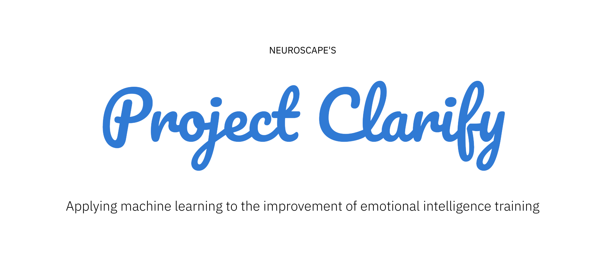
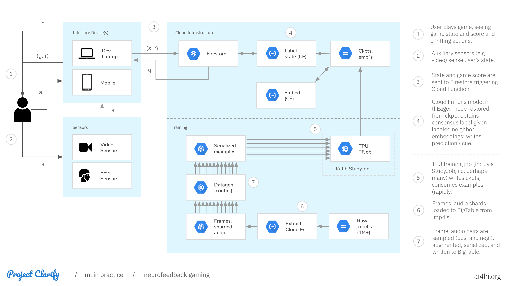

<a href="https://kubeflow.org" target="_blank"></img></a>

Towards clarifying our signals processing capabilities for various neural- and bio-sensing modalities (including for example de-noising, artifact removal, and feature identification); towards providing a mature foundation for transfer- and co-learning of predictors that provide value to the medical community; towards enabling biofeedback gaming that enhances users' self-awareness and self-regulatory skills regarding cognitive and emotional states (e.g. akin to making it easier to learn mindfulness meditation).

Find an intro to our machine learning methods at <a href="https://ai4hi.org/machine-learning" target="_blank">ai4hi.org/machine-learning</a> and a more technical summary of our current research plan [here](https://github.com/projectclarify/pcml/blob/master/docs/research-plan.md). A legacy version of a whitepaper originating the project can be found [here](https://github.com/projectclarify/experiments/raw/25e5a3e8f7854dc58f54db28cfda99181eb43b9e/public/assets/docs/project_clarify_whitepaper.pdf). Somewhat blue-sky interface design prototypes can be found at <a href="https://ai4hi.org/interface-design" target="_blank">ai4hi.org/interface-design</a>.

The following provides an overview of the computational infrastructure (on the Google Cloud) that enables us to make productive use of large-scale, high-content datasets including feeding Cloud TPUs at the necessary rate.

Various additional options are available for model deployment that offer lower-latency than the diagrammed option which is the simplest from a research prototyping perspective (enabling cross-platform support for all moderate-latency applications), see also [TFLite](https://www.tensorflow.org/lite), [tfjs](https://www.tensorflow.org/js), and [TFServing](https://www.kubeflow.org/docs/components/serving/tfserving_new/).

### Documentation outline (work in progress):

1. Audio/video correspondence learning
    1. [Extract raw .mp4's to GCS](docs/extract-videos.md)
2. Facial expression perceptual similarity
    1. [Preprocess and generate examples](docs/fec.md)
